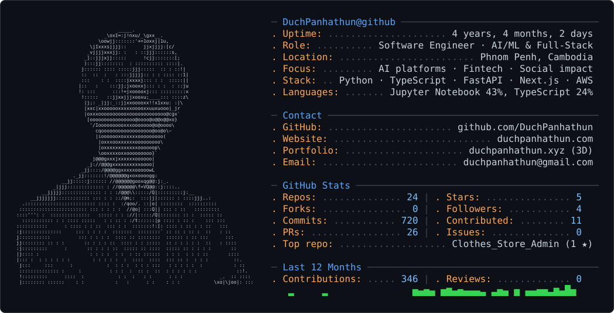

## Hi there 👋 I'm Duch Panhathun (Thun)

<picture>
  <source media="(prefers-color-scheme: dark)" srcset="dark_mode.svg" />
  <source media="(prefers-color-scheme: light)" srcset="light_mode.svg" />
  
</picture>

**Software Engineer — AI/ML & Full-Stack** · Phnom Penh, Cambodia 🇰🇭

I specialise in applied machine learning and full-stack product engineering, with production experience across AI platforms, fintech, e-commerce, and social-impact technology. My work spans deep-learning computer vision, gradient-boosted tabular ML, embedding-based semantic matching, LLM integration, and distributed web scraping, alongside production backend and frontend engineering in Python/FastAPI, NestJS, and TypeScript/Next.js on AWS.

🌐 [duchpanhathun.com](https://www.duchpanhathun.com/) · 🧊 [3D portfolio](https://www.duchpanhathun.xyz/) · ✉️ [duchpanhathun@gmail.com](mailto:duchpanhathun@gmail.com) · 📄 [Published research](https://doi.org/10.5281/zenodo.15618190)

### 🏆 Highlights

- 🥇 **Top 20 of 100+ ASEAN teams** in the Pan-SEA AI Developer Challenge 2025 (AI Singapore), awarded USD 10,000 in AWS credits to scale the solution
- 📄 **Published research:** online-payment fraud detection on 6.36M transactions, reaching **99.96% ROC-AUC** and **99.79% F1** with CatBoost ([DOI](https://doi.org/10.5281/zenodo.15618190))
- 🌾 **Deployed crop-disease recognition models** serving farmers through a Telegram chatbot: **98.06%** accuracy on cucumber diseases, **99.74%** on cauliflower diseases
- 🚀 **Bootstrapped a SaaS app from an empty repo** at Ailsa and served as its primary engineer (founding commit, ~62% of all commits)
- 🏅 **Gold Medal, NAVA-Thon Hackathon 2023** for a Telegram chatbot promoting positive parenting and child protection

### 💼 Experience

**Python Engineer — [Ailsa HQ Limited](https://github.com/Ailsa-io)** · May 2025 – Aug 2026
 UK-based AI grant-funding discovery and application platform · six services with AI throughout

- Built the production scraping tier: five scrapers for major UK and EU funding bodies (EU Funding & Tenders Portal, EUREKA, Innovate UK, NIHR, Henry Royce Institute), each with a different extraction strategy and its own automated tests
- Designed the normalisation layer mapping five funder sources onto one grant model, plus an adapter onto the legacy MongoDB schema
- Built a provider-agnostic LLM classification and structured-extraction layer (OpenAI and Anthropic), and contributed to the embedding-based grant-matching engine
- Bootstrapped the customer-facing app (Next.js 16, React 19, Auth0, AWS Amplify) and designed its department- and section-level access control
- Designed service-to-service auth for an external AI agent, and an async scraping pipeline on AWS SQS with MongoDB status tracking and audit logging

Python/FastAPI · Next.js · Node.js/Express · MongoDB · AWS (EC2, ECS, Lambda, SQS, S3, EventBridge, CloudWatch, Amplify) · Auth0 · OpenAI & Anthropic · Docker · Terraform · GitHub Actions

**IT Consultant — Save the Children Cambodia** · Nov 2025 – Jun 2026

- **Plant disease recognition:** trained and deployed models behind a Telegram chatbot that identifies crop diseases and recommends treatment. ConvNeXt-Large and EfficientNet-B5 for cucumber (7 classes, 98.06% accuracy, 94.82% macro-F1); EfficientNetB3 for cauliflower (5 classes, 99.74% accuracy, 99.68% macro-F1). Training pipelines in PyTorch and TensorFlow/Keras used focal loss, mixed precision, and cosine scheduling
- Built a Khmer-language weather advisory microservice for the chatbot, and a bilingual admin dashboard with automated weather alerts
- **Coffee business management system:** POS and ERP (Angular + NestJS) with dual-currency USD/KHR cash handling, payroll, purchasing, P&L, and recipe costing; a customer ordering site with wallet and gamified loyalty; a Telegram Mini App; and Bakong/KHQR and ABA PayWay payments
- Integrated OpenAI structured output to assign loyalty badges, validated against a closed catalogue with a deterministic fallback, and made payment endpoints retry-safe with idempotency keys

PyTorch · TensorFlow/Keras · Angular · NestJS · Next.js · TypeScript · Sequelize/PostgreSQL · Telegram Bot API & Mini Apps · Socket.IO · Docker

**IT Intern — Save the Children Cambodia** · Feb 2024 – Mar 2025

- **Remote Positive Parenting:** Khmer-language website and Telegram chatbot for parents, with an admin CMS and a campaign and quiz broadcast scheduler (React, Firebase)
- **Partnership Management System:** four-level Cambodian address hierarchy, document management, report review workflow, and role-based access. I wrote ~85% of the code (Laravel, Next.js, PostgreSQL, Docker)
- First cucumber plant-disease recognition model, served through a Telegram chatbot (Python, Flask)

**Freelance & short-term contracts**

- **Web Development Consultant — CCYMCR** (Mar 2026): bilingual English/Khmer website for a child-rights movement, with a hand-built CMS covering ~30 editable sections and an interactive province map (Next.js, Supabase, Leaflet, Vercel)
- **Web Developer — Garden Options, UK** (Dec 2025): conversion-focused marketing site in Framer with a custom React contact-form component, EmailJS, and full on-page SEO
- **Data work:** data interpretation and visualisation for the CWEA Project (2025, Python, Excel); data collection for Vikasa Advisory and Academy (2026) and Confluences Asie (2023)

### 🔬 Research

**[Improving Online Payment Fraud Detection with Feature Engineering and Cost-Sensitive Machine Learning](https://doi.org/10.5281/zenodo.15618190)** · Royal University of Phnom Penh, June 2025

End-to-end pipeline on 6.36M transactions with behavioural and temporal feature engineering. It compares six algorithms and handles class imbalance with cost-sensitive weighting instead of oversampling. CatBoost reached 99.96% ROC-AUC and 99.79% F1. Published on Zenodo (CC-BY 4.0) and indexed on ResearchGate.

### 🧰 Tech stack

  

  

- **Languages:** Python, TypeScript, JavaScript, PHP, SQL
- **AI / ML:** PyTorch, TensorFlow/Keras, scikit-learn, CatBoost, XGBoost, LightGBM · CNNs and vision transformers (ConvNeXt, EfficientNet, Swin) · embeddings and vector search · RAG (LangChain, FAISS) · OpenAI and Anthropic APIs
- **Backend:** FastAPI, NestJS, Django REST Framework, Laravel, Node.js/Express, Next.js Server Actions and API routes
- **Frontend:** Next.js, React, Angular, Tailwind CSS, Angular Material, Radix UI, Framer
- **Databases:** MongoDB, PostgreSQL, MySQL, Supabase, Firebase/Firestore, Redis
- **Cloud & DevOps:** AWS (EC2, ECS, Lambda, SQS, S3, EventBridge, CloudWatch, Parameter Store, Amplify, Route 53), Docker, GitHub Actions, Terraform, Vercel, Cloudflare R2, GCP
- **Integrations:** Telegram Bot API and Mini Apps, Bakong KHQR, ABA PayWay, Auth0, Stripe, Google OAuth, EmailJS

### 🎓 Education

- **Bachelor of Information Technology Engineering** — Royal University of Phnom Penh, graduated May 2025
- **Samsung Innovation Campus scholarship** (2022) — one of the top 60 students nationally, covering Python and data analysis

### 🏅 Awards & recognition

- **Top 20 — Pan-SEA AI Developer Challenge 2025** (AI Singapore), among 100+ ASEAN teams
- **International Seminar Delegate, China** (2024) — 1 of 8 participants, Management and Protection of Nature Reserves
- **Gold Medal — NAVA-Thon Hackathon** (2023)
- **NICC 9th Startup Camp (ICT)** (2023)
- **Silver Medal — Angkor Mathematics Cambodia** (2022), among 2,000+ participants
- **Mathematics Outstanding Student Cambodia** (2021), national finalist
